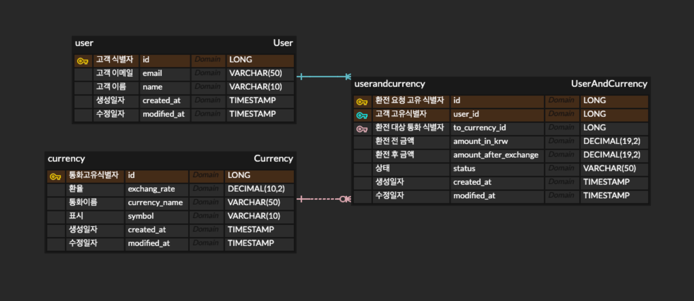

## [스파르타 코딩클럽 내일 배움 캠프] Spring 심화 프로젝트
# 유저가 가진 금액을 환율 데이터를 통해 환전 해주는 API 제작.

### Tech Stack

>JAVA : JDK 17
> 
> Spring Boot : 3.3.5
> 
> IDE : IntelliJ
> 
>MySQL : Ver 9.1.0

API 명세서
---
> 일정 관리 앱  API 설계

| 기능 | Method | URL | request | response | 상태코드 |
|:-------:|:-----:|----|-----|------|------|
|전체 일정 조회|GET   |./calender           |요청 body          |다건 응답 정보|200 정상조회    |
|일정 상세 화면|GET   |./clender/{id}        |요청 param         |단건 응답 정보|200 정상조회 / 400 Bad Request("없는 일정입니다." |
|일정 등록    |POST  |./calender           |요청 body          |등록 정보    |200 정상등록   |
|일정 삭제    |DELETE|./calender{id}       |요청 param 요청 body|수정 정보    |200 정상삭제 / 404 Not Fount   |
|일정 수정    |PUT   |./calender{id}       |요청 param         |삭제 정보    |200 정상수정/등록|

ERD
---

https://www.erdcloud.com/d/Ne9CtkgNfjEZ4eN8C
